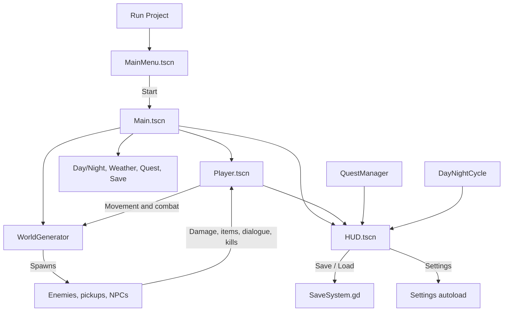

# Random RPG Architecture

This document explains how the prototype starts, how gameplay systems communicate, and what each project file is responsible for.

## 1. Game Flow

### Startup sequence

1. Godot reads `project.godot` and starts `scenes/ui/MainMenu.tscn`.
2. `MainMenu.gd` connects the Start, Settings, and Quit buttons.
3. Start changes the active scene to `scenes/Main.tscn`.
4. `Main.tscn` creates the player, HUD, world generator, quest manager, weather, day/night light, and save system.
5. `Main.gd` connects player and quest signals to HUD update functions.
6. The HUD captures the mouse for gameplay. The player receives mouse motion for camera look and keyboard input for movement.
7. `WorldGenerator.gd` creates terrain chunks around the player and populates them with props and gameplay entities.

## 2. Gameplay Loop

### Movement and camera

- `Player.gd` reads physical keyboard input for WASD movement, sprinting, crouching, jumping, and rolling.
- The player is a `CharacterBody3D` with a `SpringArm3D` and `Camera3D` defined in `Player.tscn`.
- Mouse motion rotates the player and camera pitch.
- Mouse sensitivity comes from the `Settings` autoload and can be changed in the settings UI.
- When inventory or pause UI is open, the player stops gameplay movement and the HUD manages cursor visibility.

### World streaming

- `WorldGenerator.gd` follows the player and keeps nearby terrain chunks loaded.
- Each chunk is represented by `TerrainChunk.gd`.
- Chunks generate a heightmap mesh and matching collision shape.
- Props are scattered deterministically per chunk.
- Enemies, pickups, and NPCs are spawned around the active world.

### Combat and progression

1. The player attacks with the left mouse button.
2. Nearby enemies receive damage through `Enemy.take_damage()`.
3. Enemy AI patrols, chases, and attacks the player.
4. Enemy deaths notify `QuestManager.gd` and award quest progress.
5. The player gains XP through `Player.gd` and levels up when enough XP is accumulated.
6. Health, stamina, mana, XP, level, quest text, position, and time are displayed through the HUD.

### Items and equipment

1. `WorldGenerator.gd` creates `Pickup.tscn` instances.
2. `Pickup.gd` detects the player and calls `Player.collect_item()`.
3. Weapons and armor are added to inventory and equipped automatically.
4. Consumables heal the player and are removed after use.
5. `HUD.gd` reads the inventory and displays item names and equipped bonuses.

## 3. UI Flow

### Main menu

`MainMenu.tscn` is the project entry screen.

- **Start** loads the world scene.
- **Settings** opens the shared settings panel.
- **Quit** exits the application.

`MainMenu.gd` controls these buttons and returns from the settings panel to the main menu.

### In-game HUD

`HUD.tscn` is a `CanvasLayer`, so it stays over the 3D world.

The HUD includes:

- Health, stamina, mana, and XP bars
- Level, time, quest, debug, and message labels
- Inventory and equipment panel
- Pause overlay
- Settings panel

`HUD.gd` is always processing so it can handle pause-menu input while the scene tree is paused.

### Inventory

- `I` opens and closes inventory.
- `Esc` closes inventory when it is open.
- Inventory opening shows the cursor; closing it captures the cursor again.
- The player stops movement while the inventory is open.

### Pause menu

- `P` opens and closes the pause menu.
- `Esc` opens pause during normal gameplay and closes it while paused.
- Pause options are Save Game, Load Game, Settings, Resume, and Quit to Menu.
- The scene tree is paused while the pause overlay is visible.

### Settings

The same `SettingsPanel.tscn` is instanced in both the main menu and pause menu.

Current options:

- **Mouse Sensitivity:** controls camera rotation speed.
- **Brightness:** updates the world environment adjustment brightness.

Settings are stored in `user://random_rpg_settings.json` and loaded by the `Settings` autoload when the project starts.

## 4. Save and Load Flow

`SaveSystem.gd` stores JSON in `user://random_rpg_save.json`.

The save payload contains:

- Player position and rotation
- Camera pitch
- Health, mana, stamina, and maximum values
- Level and XP progression
- Attack damage and defense
- Inventory items
- Equipped weapon and armor
- Quest kill count and completion state
- Day/night time and current day

The flow is:

1. The pause menu emits `save_requested` or `load_requested`.
2. `Main.gd` receives the signal and passes the player, quest manager, and day/night cycle to `SaveSystem.gd`.
3. `SaveSystem.gd` writes or reads JSON.
4. Loaded values are applied to the owning gameplay systems.
5. Player signals refresh HUD values after loading.

## 5. File Reference

### Project configuration

| File | Responsibility |
| --- | --- |
| `project.godot` | Godot project settings, main scene, renderer, physics engine, input actions, and `Settings` autoload. |
| `README.md` | Quick start, controls, roadmap, and high-level project summary. |
| `ARCHITECTURE.md` | Detailed runtime flow and file reference. |

### 3D scenes

| File | Responsibility |
| --- | --- |
| `scenes/Main.tscn` | Main world composition: player, environment, sun, world, quests, weather, HUD, and save system. |
| `scenes/Player.tscn` | Player body, capsule collision, mesh, spring arm, and camera rig. |
| `scenes/Enemy.tscn` | Enemy body, visuals, collision, and enemy script instance. |
| `scenes/Pickup.tscn` | Collectible world item body and pickup script instance. |
| `scenes/NPC.tscn` | Dialogue-triggering NPC body and NPC script instance. |

### UI scenes

| File | Responsibility |
| --- | --- |
| `scenes/ui/MainMenu.tscn` | Start, Settings, and Quit entry screen. |
| `scenes/ui/HUD.tscn` | In-game status display, inventory panel, pause menu, and pause settings instance. |
| `scenes/ui/SettingsPanel.tscn` | Reusable mouse sensitivity and brightness controls. |

### Gameplay scripts

| File | Responsibility |
| --- | --- |
| `scripts/Main.gd` | Connects world systems and HUD signals; routes save, load, and quit actions. |
| `scripts/Player.gd` | Movement, camera rotation, stamina, health, mana, XP, leveling, melee attacks, inventory, equipment, and damage handling. |
| `scripts/WorldGenerator.gd` | Streams terrain chunks and populates chunks with props, enemies, pickups, and NPCs. |
| `scripts/TerrainChunk.gd` | Generates procedural terrain mesh and heightmap collision for one chunk. |
| `scripts/Enemy.gd` | Enemy patrol, chase, attack, damage, death, and quest-kill notification behavior. |
| `scripts/Pickup.gd` | Pickup bobbing, player detection, and item collection handoff. |
| `scripts/NPC.gd` | Proximity-based NPC dialogue messages. |
| `scripts/QuestManager.gd` | Kill-count quest state, completion, HUD text, and XP reward. |
| `scripts/DayNightCycle.gd` | Advances time, rotates the sun, adjusts lighting, and formats the displayed time. |
| `scripts/Weather.gd` | Controls rain visibility and weather-related environment changes. |

### UI and persistence scripts

| File | Responsibility |
| --- | --- |
| `scripts/MainMenu.gd` | Main menu button behavior and settings panel visibility. |
| `scripts/HUD.gd` | HUD updates, inventory visibility, pause flow, cursor mode, and UI signals. |
| `scripts/Settings.gd` | Autoloaded settings state, JSON persistence, and brightness application. |
| `scripts/SettingsPanel.gd` | Slider behavior and value labels for the reusable settings panel. |
| `scripts/SaveSystem.gd` | JSON save/load for player, inventory, quest, and day/night state. |

### Data scripts

| File | Responsibility |
| --- | --- |
| `scripts/Item.gd` | Resource definition for weapon, armor, and consumable item data. |
| `scripts/Inventory.gd` | Lightweight inventory item list with add and remove operations. |

### Shader

| File | Responsibility |
| --- | --- |
| `shaders/terrain.gdshader` | Colors procedural terrain based on height and slope, with back-face culling disabled for reliable terrain rendering. |

Files ending in `.uid` are Godot-generated resource identifiers. They should normally be left untouched.

## 6. Important Signals and Boundaries

- `Player.health_changed`, `stamina_changed`, `mana_changed`, and `xp_changed` update HUD bars.
- `QuestManager.quest_updated` updates the quest label.
- `HUD.save_requested`, `load_requested`, and `quit_requested` are handled by `Main.gd`.
- `SettingsPanel.close_requested` returns control to its owning menu.
- `SaveSystem.save_completed` reports save/load status to the pause menu.

The main ownership rule is: gameplay state belongs to gameplay nodes, presentation belongs to the HUD, and cross-system orchestration belongs to `Main.gd`.

## 7. Extending the Prototype

When adding a feature:

1. Put persistent gameplay state in the owning gameplay script or resource.
2. Add signals for values that the HUD needs to display.
3. Route cross-system coordination through `Main.gd` or a dedicated manager.
4. Add save/load fields in `SaveSystem.gd` if the state must persist.
5. Add UI controls to the relevant scene and keep reusable panels as separate scenes.
6. Update `README.md` for player-facing controls and this document for architecture changes.
